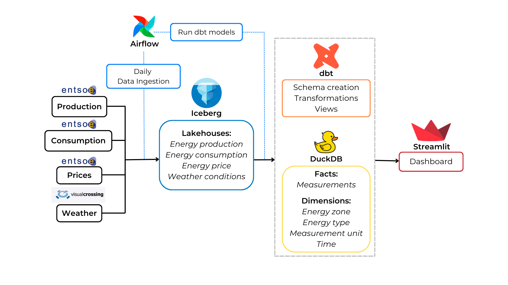

# WattWatchers

## Table of Contents
- [Overview](#overview)
- [Features](#features)
- [Installation and Usage](#installation_and_usage)
- [ALIs](#APIs)

## Overview
As nations work towards ambitious climate goals, gaining a deeper understanding of renewable energy dynamics, weather patterns, and their economic implications is more important than ever. 
This project provides actionable insights through real-time visualizations and reports, exploring the interplay between renewable energy production and energy consumption in Northern Europe, 
while also examining the influence of weather patterns. Using open-source APIs from ENTSO-E and VisualCrossing, this project leverages cutting-edge tools to deliver valuable data-driven perspectives.

The energy markets and weather conditions are monitored through an automated data pipeline built using a Dockerized environment and orchestrated with Apache Airflow. 
Raw data is ingested into an Apache Iceberg data lakehouse, queried, and processed using dbt (data build tool) to meet specific analytical requirements. 
Further transformations, including the creation of star schemas within DuckDB, are managed by Airflow DAGs. 
These transformations prepare the necessary tables for an interactive Streamlit dashboard that facilitates data exploration and visualization.

## Features
- Automated data pipeline for seamless ingestion, transformation, and analysis.
- Interactive dashboard powered by Streamlit for real-time visualizations.
- In-depth insights into the relationship between renewable energy, weather, and market dynamics.
- Intuitive star-schema populated for ease of use for downstream users such as ML engineers or analysts

## Installation and Usage
1. Install Docker
   Ensure Docker is installed on your system. [Docker Installation Guide](https://docs.docker.com/get-docker/).

2. Clone repository

3. Populate API keys for ENTSO-E and VisualCrossing into .env file based on env-sample found in PROTO directory

4. In the /PROTO/config_files/config_dates.json file, set the time period for data ingestion.
    (For testing, a maximum of 48h duration highly recommended.)

5. Modify the /PROTO/config_files/country_code_mapper.csv to select the countries or electricity bidding zones you wish to analyze. By default currently there are all countries around the Baltic Sea.

6. In the /PROTO directory, start the services by running:
    docker compose up
7. Open your browser and go to http://localhost:8080 to access the Airflow UI.

8. In the Airflow UI, trigger DAG "1_extract_load" to populate the Iceberg data lakehouse and DuckDB with raw data.

9. Once DAG 1_ completes, trigger DAG "2_star_schema" to create the star schema and enable the Streamlit dashboard.

10. After DAG "2_star_schema" completes, open your browser and go to http://localhost:8501 to interact with the real-time Streamlit dashboard.

## APIs
This project uses the following APIs:

- **Electricity Data** (ENTSO-E):  
   Provides detailed data on electricity consumption and production. [API Documentation](https://transparencyplatform.zendesk.com/hc/en-us/articles/15692855254548-Sitemap-for-Restful-API-Integration)
  
- **Weather Data** (VisualCrossing):  
   Provides weather data, including temperature, precipitation, and other conditions. [API Documentation](https://www.visualcrossing.com/weather-api)
